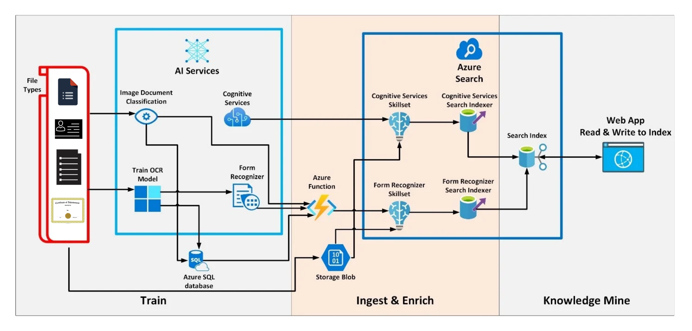
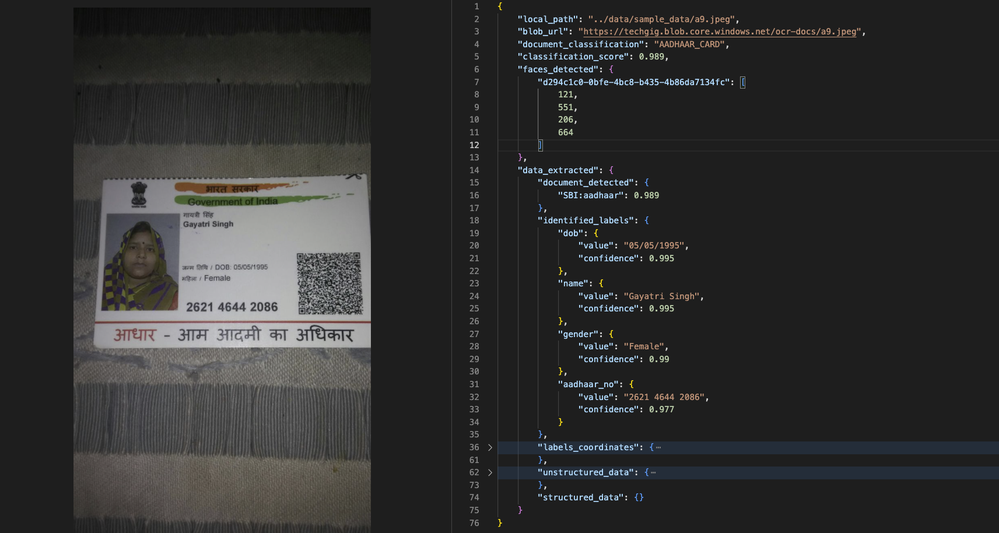
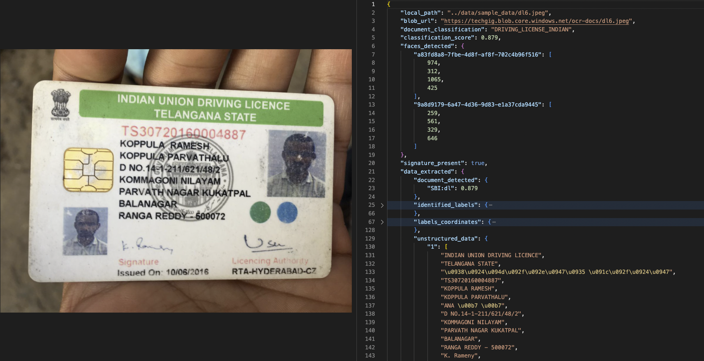
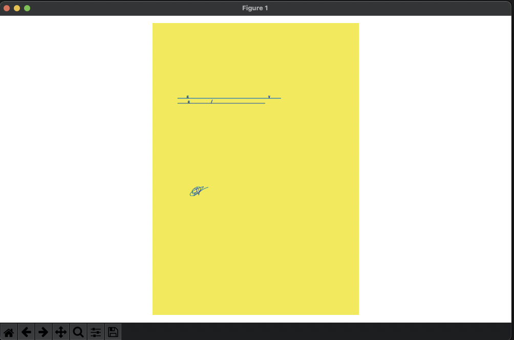

# [SBI - Identification & Optical character recognition (OCR) for Structured Documents](https://www.techgig.com/hackathon/optical-character-recognition)

## Objective
```
Documents that are used during the process of daily operations can be stored as image files or in PDF.

The documents can be of varied types such as:
- Application forms
- Customer Request forms
- Account Opening Forms
- KYC Documents
- Agreements
- Reports
- Certificates
- Confidential Reports
- Account Statements
- Varied document formats including OVDs

For this kind of documents (structured or unstructured), OCR needs to be performed for direct obtention of data from the document, suitable tagging as well as to make the content searchable. This helps in customer onboarding as well as customer relationship enhancement during the lifecycle of any deposit or loan account / service.

Officially Valid Documents – OVDs such as Aadhaar card, Driving License, Voter Identity card, PAN card
```

## Solution Expected:
```
Solution Expected:
    The following are the expectations from the prototype:

        Document / Image can be:
            Standardised KYC
            Structured Document
            Unstructured documents

        Obtain from document / image:
            Document Identification
            Customer / Account Identification
            Structured Text within Document
            Unstructured Text within Document
            Photograph of Customer
            Official Signature
            Customer Signature
            Document Attestation

    In case of certain documents such as Aadhar Cards, obtaining the Aadhar number & saving a copy of the document after masking the Aadhar Number from within the document.

    Classify the OCR accuracy Score as per clarity of Text in document
```

## Solution Architecture - POC


## Solution Architecture - PRODUCTION



## Solution Samples

### Classification

#### PDF's


### Images


### Face Detection

#### AZURE


#### AZURE- Images


#### CUSTOM - Pdfs


### DATA EXTRACTION

#### Entities


#### Structured


#### Unstructured - Images


#### Unstructured - PDFs


### Signature Detection

#### PDF's


#### Images


### Signature Detection Local Process

#### Loader
The loader reads the file and creates a mask.


#### Extractor
The extractor, first, generates the regions from the mask.



#### Cropper
The cropper finds the contours of regions in the labeled masks and crop them.


### KYC Masking

#### Aadhaar


#### Passport


#### Pan Card


#### Driving License
