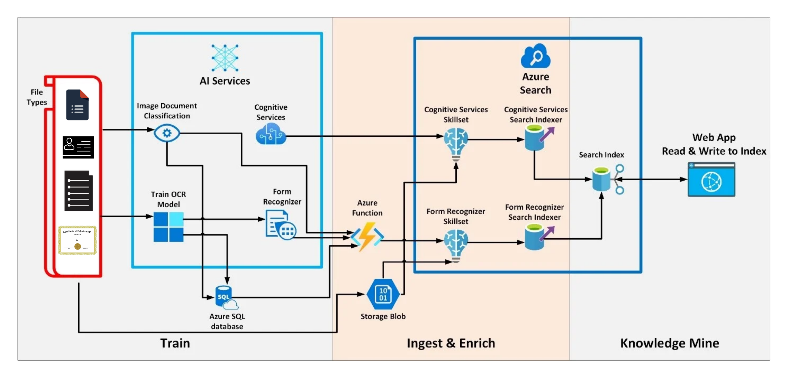

# [SBI - Identification & Optical character recognition (OCR) for Structured Documents](https://www.techgig.com/hackathon/optical-character-recognition) - Idea submission

## Objective
```
Documents that are used during the process of daily operations can be stored as image files or in PDF.

The documents can be of varied types such as:
- Application forms
- Customer Request forms
- Account Opening Forms
- KYC Documents
- Agreements
- Reports
- Certificates
- Confidential Reports
- Account Statements
- Varied document formats including OVDs

For this kind of documents (structured or unstructured), OCR needs to be performed for direct obtention of data from the document, suitable tagging as well as to make the content searchable. This helps in customer onboarding as well as customer relationship enhancement during the lifecycle of any deposit or loan account / service.

Officially Valid Documents – OVDs such as Aadhaar card, Driving License, Voter Identity card, PAN card

Solution Expected:
The following are the expectations from the prototype:
Document / Image can be:
    Standardised KYC
    Structured Document
    Unstructured documents

Obtain from document / image:
    Document Identification
    Customer / Account Identification
    Structured Text within Document
    Unstructured Text within Document
    Photograph of Customer
    Official Signature
    Customer Signature
    Document Attestation

In case of certain documents such as Aadhar Cards, obtaining the Aadhar number & saving a copy of the document after masking the Aadhar Number from within the document.

Classify the OCR accuracy Score as per clarity of Text in document
```

## Solution Proposed (POC)
```
The idea is to use the following:

- AI Services to classify different documents (Image document Classification)
- Cognitive Services to extract text from the documents(Computer Vision OCR):
- Processor Models trained to extract required entities (Form Recognizer)
- AI services to extract NERs,detect language, translate if needed, key-value extraction
- Azure Functions for parallel processing of videos and scaling
- Custom model to extract face and signatures from documents
The FLow of Processing:

1. The flow starts with reading documents from edge devices and publishing them on the azure blob for processing.
2. Once a new document is uploaded (synchronized) in Azure Blob Storage, it shall be immediately processed.
3. Azure Blob storage has a trigger that executes a simple Azure function that sends the message to Azure Queue
4. Azure Queue has a trigger that executes an advanced Azure function that 
    1) retrieves documents from a blob storage account
    2) extract required entities by calling other services attached 
    3) writes results to an Azure database
5) Optionally, one can connect this to Web App to see results 

```

## Architecture (POC)
